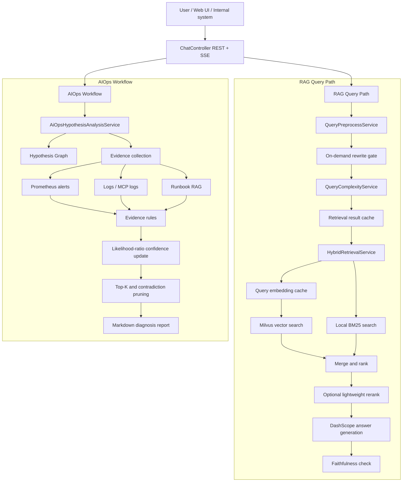
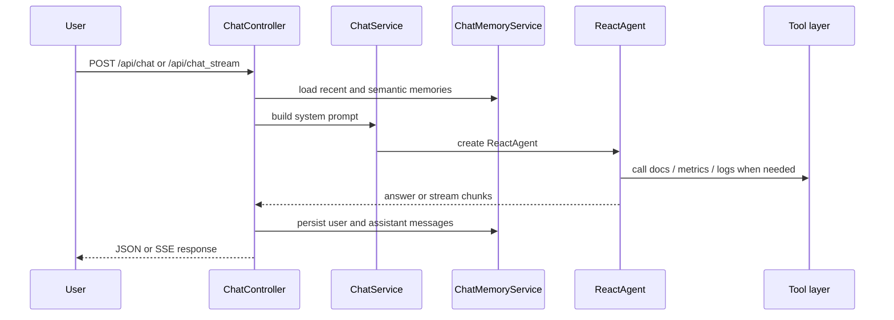
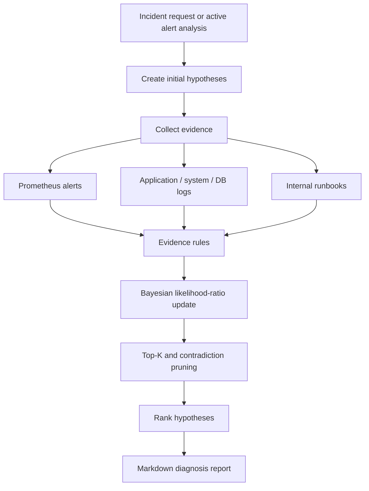

# DevAssist Agent

DevAssist Agent is a Java/Spring Boot service for internal support and on-call workflows. It combines RAG, tool calling, session memory, metrics/log evidence collection, and AIOps diagnosis to help engineers analyze tickets, retrieve internal runbooks, and produce evidence-backed reports.

The project is intentionally platform-neutral. A ticket can come from an issue tracker, chat bot, alerting system, or any internal support entrypoint, as long as it can be mapped to a text request.

## System Overview



## Main Capabilities

- Ticket and incident analysis through REST and SSE APIs.
- RAG over internal runbooks and uploaded documents.
- Hybrid retrieval with Milvus vector search and local BM25 search.
- Query preprocessing, retrieval routing, lightweight reranking, and answer faithfulness checks.
- Tool calling for internal docs, Prometheus alerts, logs, and current time.
- Redis-backed short-term session memory and Milvus-backed semantic memory.
- AIOps diagnosis based on a Hypothesis Graph with evidence scoring and pruning.
- Lightweight harness for regression checks against RAG and Agent outputs.

## Runtime Flow

### Chat Flow



### RAG Flow

```mermaid
flowchart LR
    Q[User question] --> PRE[Query preprocess]
    PRE --> GATE[On-demand rewrite gate]
    GATE --> ROUTE[Complexity route]
    ROUTE --> RCACHE[Retrieval cache]
    RCACHE --> HYBRID[Hybrid retrieval]
    HYBRID --> ECACHE[Query embedding cache]
    ECACHE --> VEC[Milvus vector search]
    HYBRID --> BM25[Local BM25 search]
    VEC --> MERGE[Score merge]
    BM25 --> MERGE
    MERGE --> RERANK[Optional rerank]
    RERANK --> CTX[Build context]
    CTX --> LLM[DashScope generation]
    LLM --> FAITH[Faithfulness check]
    FAITH --> OUT[Answer with sources]
```



### AIOps Flow



The AIOps module does not rely on a pure prompt-driven planner for root-cause state. It stores candidates, evidence, confidence updates, and pruning results in code-level structures under `org.example.service.aiops`.

## Project Structure

```text
devassist-agent/
├── aiops-docs/                         # Example runbooks
├── harness/                            # Regression runner and JSON cases
├── src/main/java/org/example/
│   ├── agent/tool/                     # Tool-calling adapters
│   ├── client/                         # Milvus client factory
│   ├── config/                         # Spring and infrastructure config
│   ├── controller/                     # REST/SSE controllers
│   ├── dto/                            # Request and response DTOs
│   └── service/
│       ├── aiops/                      # Hypothesis Graph diagnosis workflow
│       ├── RagService.java             # RAG answer generation
│       ├── TrustedRagRetrievalService.java
│       ├── HybridRetrievalService.java
│       ├── VectorSearchService.java
│       ├── KeywordSearchService.java
│       └── ChatMemoryService.java
├── src/main/resources/
│   ├── static/                         # Web UI
│   └── application.yml                 # Application configuration
├── vector-database.yml                 # Milvus / Redis compose file
├── Makefile
└── pom.xml
```

## Requirements

- Java 17
- Maven 3.8+
- Docker / Docker Compose
- DashScope API key

## Quick Start

### 1. Configure Environment

```bash
export DASHSCOPE_API_KEY=your-dashscope-api-key
```

Optional MCP configuration:

```bash
export MCP_CLIENT_ENABLED=true
export TENCENT_MCP_URL=https://mcp-api.tencent-cloud.com
export TENCENT_MCP_SSE_ENDPOINT=/sse/your-endpoint
```

### 2. Start Milvus and Redis

```bash
docker compose -f vector-database.yml up -d
```

Default endpoints:

```text
Milvus: localhost:19530
Redis:  localhost:6379
```

### 3. Start the Service

```bash
mvn clean install
mvn spring-boot:run
```

The service starts at:

```text
http://localhost:9900
```

## API

### Chat

```http
POST /api/chat
Content-Type: application/json

{
  "Id": "session-001",
  "Question": "How should I investigate a 500 error in order-service?"
}
```

### Streaming Chat

```http
POST /api/chat_stream
Content-Type: application/json

{
  "Id": "session-001",
  "Question": "Analyze this incident and return a step-by-step plan."
}
```

### AIOps Diagnosis

```http
POST /api/ai_ops
Content-Type: application/json

{
  "userRequest": "payment-service is unavailable, CPU is high, and several database timeout logs were observed."
}
```

The endpoint returns an SSE stream with a Markdown report. If the request body is omitted, the service analyzes current active alerts and available evidence.

### Upload Documents

```bash
curl -X POST http://localhost:9900/api/upload \
  -F "file=@aiops-docs/cpu_high_usage.md"
```

Uploaded files are chunked, embedded, stored in Milvus, and indexed by the local BM25 service.

## Configuration

Main configuration file:

```text
src/main/resources/application.yml
```

Important sections:

```yaml
server:
  port: 9900

spring:
  data:
    redis:
      host: ${REDIS_HOST:localhost}
      port: ${REDIS_PORT:6379}
  ai:
    dashscope:
      api-key: ${DASHSCOPE_API_KEY:your-api-key-here}
    mcp:
      client:
        enabled: ${MCP_CLIENT_ENABLED:false}

milvus:
  host: localhost
  port: 19530

rag:
  top-k: 3
  model: "qwen3-max"
  query-rewrite:
    enabled: true
    min-similarity: 0.8
  retrieval:
    simple-mode: HYBRID
    complex-mode: HYBRID
    candidate-multiplier: 3
    vector-weight: 0.65
    bm25-weight: 0.35
  rerank:
    enabled: true
  faithfulness:
    enabled: true

chat:
  memory:
    redis-enabled: true
    semantic-enabled: true
```

## AIOps Hypothesis Graph

The AIOps workflow is implemented under:

```text
src/main/java/org/example/service/aiops
```

It uses the following concepts:

- `HypothesisNode`: candidate root cause with prior and posterior confidence.
- `EvidenceNode`: alert, metric, log, runbook, or tool-error evidence.
- `EvidenceStrength`: evidence level mapped to a likelihood ratio.
- `HypothesisGraph`: graph storage for hypotheses, evidence, and relationships.
- `AiOpsEvidenceRuleService`: maps evidence to hypotheses.
- `AiOpsReportService`: renders the final Markdown report.

Evidence strength is represented by likelihood ratios:

```text
STRONG_SUPPORT          LR = 10.0
MEDIUM_SUPPORT          LR = 3.0
WEAK_SUPPORT            LR = 1.5
NEUTRAL                 LR = 1.0
WEAK_CONTRADICTION      LR = 0.7
MEDIUM_CONTRADICTION    LR = 0.3
STRONG_CONTRADICTION    LR = 0.1
```

This keeps confidence changes auditable: every posterior update can be traced back to a specific evidence item and rule.

## RAG Reliability and Performance

The current RAG pipeline includes:

- Query rewrite with semantic similarity guard.
- On-demand query rewrite to avoid unnecessary LLM calls for simple queries.
- Query embedding cache for repeated vector searches.
- Retrieval result cache for repeated RAG lookups.
- Complexity-based retrieval routing.
- Hybrid vector + BM25 retrieval.
- Lightweight reranking.
- Source indexing.
- Faithfulness verification after generation.

Recommended production optimizations:

- Cache query embeddings and retrieval results.
- Trigger query rewrite only for complex or ambiguous requests.
- Run vector search and BM25 search in parallel.
- Precompute BM25 document frequency with an inverted index.
- Add request coalescing for identical hot queries.
- Route simple queries to smaller models and reserve larger models for complex reasoning.
- Limit context tokens by extracting only the most relevant snippets.
- Add rate limits and graceful degradation around embedding, Milvus, and LLM calls.

## Harness

Run the regression harness after the service is started:

```bash
python harness/runner.py
```

Specify a different base URL:

```bash
python harness/runner.py --base-url http://localhost:9900
```

Reports are written to:

```text
harness/reports/latest-report.json
```

## Development Notes

- `prometheus.mock-enabled=true` enables mock Prometheus alert data.
- `cls.mock-enabled=true` enables mock log data.
- `rag.bm25.bootstrap-enabled=true` loads local uploaded documents into the BM25 index at startup.
- `MCP_CLIENT_ENABLED=false` keeps external MCP clients disabled by default.

## License

See [LICENSE](LICENSE).
