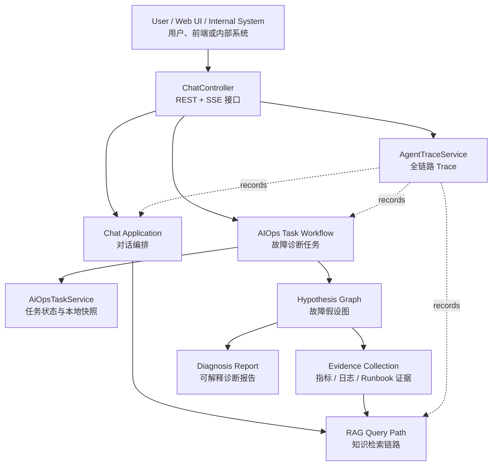
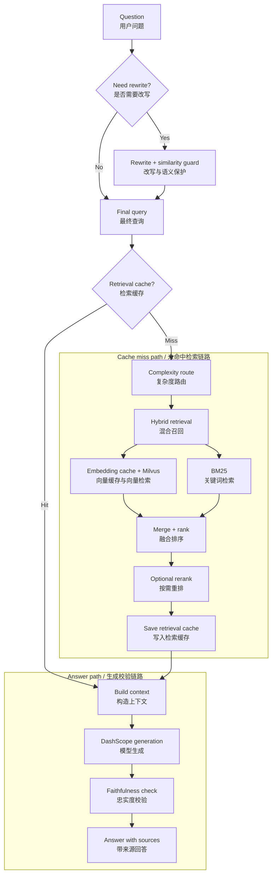
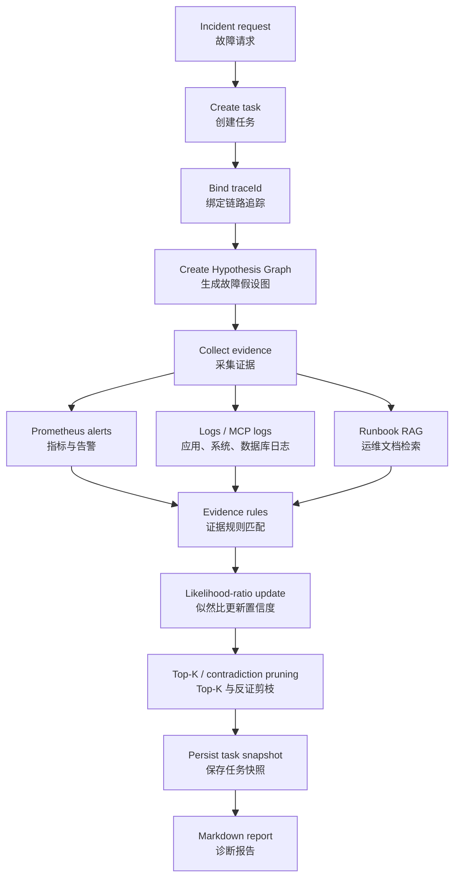

# DevAssist Agent

DevAssist Agent 是一个基于 Java / Spring Boot 的内部支持与 On-call 辅助系统。项目把 RAG 知识库问答、工具调用、会话记忆、指标/日志证据采集、AIOps 故障诊断和全链路 trace 串在一起，用来帮助工程师分析工单、检索内部 Runbook，并生成可追溯的诊断报告。

The service is platform-neutral. A request can come from a web UI, ticket system, chat bot, alerting platform, or any internal entrypoint, as long as it can be mapped to a text request.

## System Overview / 系统总览

项目主线可以分为两条：

- `RAG Query Path`：面向知识检索和可信回答，重点是 query rewrite 按需触发、缓存、混合召回、rerank 和忠实度校验。
- `AIOps Workflow`：面向故障诊断，重点是 Hypothesis Graph、证据采集、置信度更新、剪枝和任务快照。



## Main Capabilities / 核心能力

- REST 和 SSE 接口，支持普通问答、流式问答和 AIOps 诊断。
- 内部 Runbook 与上传文档的 RAG 检索，支持 `txt`、`markdown`、`log` 和原生文本 PDF。
- 文档入库前进行类型识别和结构化解析，保留页码、block 类型、parser、confidence 等元数据。
- Markdown Runbook 按标题树做语义分片，保留 `headingPath`、`sectionTitle`、`semanticBlockType`，降低 Evidence/Actions 被切断的问题。
- Milvus 向量检索 + 本地 BM25 的混合召回。
- Query rewrite 按需触发，避免简单问题也调用大模型改写。
- Query embedding cache 与 retrieval result cache，降低高频查询延迟和外部 API 成本。
- Redis 短期会话记忆与 Milvus 语义记忆。
- AIOps Hypothesis Graph：把候选根因、证据、置信度更新和剪枝过程显式建模。
- AIOps 任务化执行：每次诊断都会生成 `taskId` 和 `traceId`，支持状态查询和本地 JSON 快照。
- 全链路 trace：记录 Chat、RAG、工具调用、AIOps workflow 的关键阶段、耗时、错误和缓存命中。
- 脱敏 Benchmark 数据集：提供模拟 Runbook、研发工单和标注 case，用于比较 RAG/AIOps 升级前后的质量。

## RAG Flow / RAG 查询流程



RAG 当前重点不是“把更多文本塞给模型”，而是先把检索质量、缓存收益和可追溯性做好：简单问题少走模型调用，重复问题优先命中缓存，复杂问题再触发 rewrite、混合召回和 rerank。

## AIOps Flow / AIOps 诊断流程



AIOps 模块不会只依赖 Prompt 让模型自由判断，而是在代码层维护故障假设图。候选根因、证据节点、置信度变化和剪枝结果都能被查询、追踪和复盘。

## Trace And Task Observability / 追踪与任务状态

每次普通 Chat、流式 Chat 和 AIOps 诊断都会创建 trace。Trace 默认写入：

```text
data/traces/{traceId}.json
```

AIOps 诊断会额外创建任务快照，默认写入：

```text
data/aiops-tasks/{taskId}.json
```

相关接口：

```http
GET /api/traces
GET /api/traces/{traceId}
GET /api/ai_ops/tasks
GET /api/ai_ops/tasks/{taskId}
```

`POST /api/chat` 的响应会包含 `traceId`。`POST /api/chat_stream` 和 `POST /api/ai_ops` 会通过 SSE 先返回 trace/task 元信息，即使流式连接中断，也可以继续查询任务状态和 trace 事件。

## Project Structure / 项目结构

```text
devassist-agent/
|-- aiops-docs/                         # 示例 Runbook
|-- harness/                            # 回归验证脚本和用例
|-- src/main/java/org/example/
|   |-- agent/tool/                     # Tool Calling 适配层
|   |-- client/                         # Milvus 客户端工厂
|   |-- config/                         # Spring 与基础设施配置
|   |-- controller/                     # REST / SSE 接口
|   |-- document/                       # 文档类型识别与结构化解析
|   |-- dto/                            # 请求响应对象
|   |-- trace/                          # 全链路 trace 模型与服务
|   `-- service/
|       |-- aiops/                      # Hypothesis Graph 与任务化诊断
|       |-- ChatApplicationService.java # 对话编排
|       |-- TrustedRagRetrievalService.java
|       |-- HybridRetrievalService.java
|       |-- VectorSearchService.java
|       |-- KeywordSearchService.java
|       `-- ChatMemoryService.java
|-- src/main/resources/
|   |-- static/                         # Web UI 静态页面
|   `-- application.yml                 # 应用配置
|-- vector-database.yml                 # Milvus / Redis compose file
|-- Makefile
`-- pom.xml
```

## Quick Start / 快速启动

### 1. Configure Environment / 配置环境变量

```bash
export DASHSCOPE_API_KEY=your-dashscope-api-key
```

如需接入外部 MCP 工具，可显式开启：

```bash
export MCP_CLIENT_ENABLED=true
export TENCENT_MCP_URL=https://mcp-api.tencent-cloud.com
export TENCENT_MCP_SSE_ENDPOINT=/sse/your-endpoint
```

### 2. Start Milvus And Redis / 启动 Milvus 和 Redis

```bash
docker compose -f vector-database.yml up -d
```

默认地址：

```text
Milvus: localhost:19530
Redis:  localhost:6379
```

如果使用外部 Redis，不需要启动本地 Redis，只要通过环境变量覆盖连接信息：

```bash
export REDIS_HOST=your-redis-host
export REDIS_PORT=6379
export REDIS_PASSWORD=your-redis-password
```

如果 Redis 部署在远程服务器且只监听本机地址，可以在本地开发机建立 SSH 隧道后继续使用 `REDIS_HOST=localhost`：

```bash
ssh -L 6379:127.0.0.1:6379 ubuntu@your-server-ip
```

### 3. Start Service / 启动服务

```bash
mvn clean install
mvn spring-boot:run
```

```text
http://localhost:9900
```

## API / 接口

### Chat / 普通问答

```http
POST /api/chat
Content-Type: application/json

{
  "Id": "session-001",
  "Question": "How should I investigate a 500 error in order-service?"
}
```

响应中会包含：

```json
{
  "sessionId": "session-001",
  "traceId": "trc_xxx",
  "answer": "..."
}
```

### Streaming Chat / 流式问答

```http
POST /api/chat_stream
Content-Type: application/json

{
  "Id": "session-001",
  "Question": "Analyze this incident and return a step-by-step plan."
}
```

### AIOps Diagnosis / AIOps 诊断

```http
POST /api/ai_ops
Content-Type: application/json

{
  "userRequest": "payment-service is unavailable, CPU is high, and database timeout logs were observed."
}
```

SSE 会先返回 `task` 事件，里面包含 `taskId` 和 `traceId`，随后返回 Markdown 诊断报告。

### Upload Documents / 上传文档

上传文档后，系统会识别文档类型，解析为统一的 `ParsedDocument`，再进行语义切片、embedding、Milvus 入库，并同步构建本地 BM25 索引。

```bash
curl -X POST http://localhost:9900/api/upload \
  -F "file=@aiops-docs/cpu_high_usage.md"
```

也可以一键上传 `aiops-docs` 中的示例 Runbook：

```bash
python harness/bootstrap_docs.py --base-url http://localhost:9900
```

当前本地解析能力：

- `txt` / `log`：按原生文本解析。
- `md` / `markdown`：按 Markdown 标题树解析，切片保留章节路径、标题层级和语义块类型。
- `pdf`：使用 PDFBox 解析原生文本层，并保留 `pageNumber`。如果文本层过少，会提示后续应交给 MinerU/OCR。

后续外部解析器预留方向：

- `docx` / `pptx` / `xlsx` / `html`：适合接入 Unstructured。
- 扫描 PDF、图片、中文复杂 PDF、双栏、表格和公式密集文档：适合接入 MinerU 或 OCR 服务。

## Configuration / 配置

主配置文件：

```text
src/main/resources/application.yml
```

关键配置段：

```yaml
agent:
  trace:
    enabled: true
    persist-enabled: true
    storage-dir: ./data/traces

aiops:
  task:
    persist-enabled: true
    storage-dir: ./data/aiops-tasks

spring:
  data:
    redis:
      host: ${REDIS_HOST:localhost}
      port: ${REDIS_PORT:6379}
      password: ${REDIS_PASSWORD:}

rag:
  query-rewrite:
    enabled: true
    on-demand-enabled: true
  retrieval:
    simple-mode: HYBRID
    complex-mode: HYBRID
    cache:
      enabled: true
  faithfulness:
    enabled: true
```

## AIOps Hypothesis Graph / AIOps 故障假设图

核心实现位于：

```text
src/main/java/org/example/service/aiops
```

核心概念：

- `HypothesisNode`：候选根因，保存先验置信度、当前置信度、状态和置信度变化轨迹。
- `EvidenceNode`：告警、指标、日志、Runbook 或工具错误证据。
- `EvidenceStrength`：证据强度，映射为似然比。
- `HypothesisGraph`：保存故障假设、证据和关系的图结构。
- `AiOpsTaskService`：创建任务、运行诊断、保存快照、查询状态。

证据强度使用似然比表示：

```text
STRONG_SUPPORT          LR = 10.0
MEDIUM_SUPPORT          LR = 3.0
WEAK_SUPPORT            LR = 1.5
NEUTRAL                 LR = 1.0
WEAK_CONTRADICTION      LR = 0.7
MEDIUM_CONTRADICTION    LR = 0.3
STRONG_CONTRADICTION    LR = 0.1
```

这种设计让每次置信度变化都能追溯到具体证据和具体规则，而不是只得到一个不可解释的模型结论。

## RAG Reliability And Performance / RAG 可靠性与性能

当前 RAG 链路包括：

- 文档类型识别和结构化解析。
- Markdown heading-tree 语义分片。
- 原生 PDF 解析与页码 metadata。
- Query rewrite 语义保护。
- Query rewrite 按需触发。
- Query embedding cache。
- Retrieval result cache。
- 基于复杂度的检索路由。
- 向量检索 + BM25 混合召回。
- 复杂查询按需 rerank。
- Grounded RAG fast path：明确要求引用知识库或 Runbook 的问题直接走证据模板，减少普通 Agent 自由扩写。
- 章节相关性过滤和动作去重，避免同一 Runbook 的相邻根因章节污染回答。
- 生成后忠实度校验。
- Trace 记录缓存命中、改写决策、检索模式和结果数量。

后续生产化方向：

- 向量检索和 BM25 并行执行。
- 热点相同请求做 request coalescing。
- 简单查询路由到更小模型，复杂推理再使用大模型。
- 对 embedding、Milvus、LLM 调用增加限流和降级策略。
- 将 Unstructured / MinerU 作为外部解析服务接入，并增加解析结果缓存。

## Harness / 回归验证

服务启动后可以运行轻量回归脚本，检查 RAG 和 Agent 输出是否出现明显退化：

```bash
python harness/runner.py
```

指定服务地址：

```bash
python harness/runner.py --base-url http://localhost:9900
```

报告输出：

```text
harness/reports/latest-report.json
```

当前 Harness 测试集位于 `harness/cases`，按 `chat`、`rag`、`aiops` 三类组织：

- `chat`：验证普通闲聊不会被强制路由到可信 RAG。
- `rag`：验证 query rewrite、混合召回、来源引用和 Faithfulness 结构。
- `aiops`：验证假设图报告、证据采集、置信度更新、Top-K 剪枝、taskId 和 traceId。

用例断言包括文本包含、禁止文本、正则、JSON 字段、SSE 事件类型、taskId/traceId 和耗时阈值。Harness 目前主要做结构性回归和关键行为检查，不等同于完整语义质量评测。

常用命令：

```bash
python harness/runner.py --validate-only
python harness/runner.py --list
python harness/runner.py --category rag
python harness/runner.py --category aiops --fail-fast
```

报告会输出总通过率、按 `category` 的通过情况，以及按 `capabilities` 的能力覆盖情况，便于判断是 RAG、普通 Chat 还是 AIOps workflow 发生了退化。

如果要做升级前后 Benchmark，可以运行带标注的数据集：

```bash
python harness/bootstrap_docs.py --base-url http://localhost:9900
python harness/runner.py --cases harness/benchmark/cases --base-url http://localhost:9900 --output harness/benchmark/reports/baseline.json
```

Benchmark case 增加了 `labels` 字段：

```text
expectedSources     期望命中的 Runbook 来源
expectedRootCause   AIOps 期望根因
expectedEvidence    期望覆盖的关键证据
expectedSections    期望报告结构
```

报告中会额外汇总：

```text
Source Hit Rate
RootCause Hit Rate
Structure Hit Rate
```

离线 LLM-as-Judge 可以进一步评估语义质量：

```bash
python harness/judge_runner.py --input harness/reports/latest-report.json --output harness/benchmark/reports/judge-latest.json
```

生成可读 Markdown 报告：

```bash
python harness/benchmark_report.py --benchmark harness/benchmark/reports/structured-final6.json --judge harness/benchmark/reports/structured-final6-judge.json --output harness/benchmark/reports/structured-final6.md
```

Judge 默认使用 `qwen-plus`，通过 `DASHSCOPE_API_KEY` 调用 DashScope OpenAI-compatible 接口。它只作为 Benchmark 离线评估，不进入在线回答链路；评估结果需要和 Source Hit、RootCause Hit、结构通过率、延迟等确定性指标一起判断。

Benchmark 数据集说明：

```text
harness/benchmark/tickets/   脱敏模拟研发工单
harness/benchmark/cases/     带 labels 的 Benchmark case
harness/benchmark/sources.md 公开资料参考边界说明
```

这些数据不是企业真实工单，而是参考公开 SRE Runbook、Prometheus Operator Runbooks、Google SRE incident response 等资料的结构后构造的 synthetic benchmark data，用于可复现实验和面试讲解。

## Development Notes / 开发提示

- `prometheus.mock-enabled=true` 可启用模拟 Prometheus 告警数据。
- `cls.mock-enabled=true` 可启用模拟日志数据。
- `rag.bm25.bootstrap-enabled=true` 会在启动时把本地上传文档加载到 BM25 索引。
- `MCP_CLIENT_ENABLED=false` 时不会连接外部 MCP 服务，便于本地独立启动。
- `agent.trace.persist-enabled=true` 会把 trace 写入本地 JSON 文件。
- `aiops.task.persist-enabled=true` 会把 AIOps 任务快照写入本地 JSON 文件。

## License / 许可证

See [LICENSE](LICENSE).

## Latest Benchmark Result / 最新评估结果

2026-07-01 对 RAG 与 AIOps workflow 做了一轮端到端 Benchmark。评估方式分两层：确定性 Benchmark labels 检查 `expectedSources`、`expectedRootCause`、`expectedSections` 是否命中；离线 LLM-as-Judge 检查 faithfulness、relevance、completeness、citationQuality、actionability、riskControl 等语义质量。

| Metric | Before | After | Change |
|---|---:|---:|---:|
| Harness Pass Rate | 0.25 | 1.00 | +0.75 |
| Source Hit Rate | 0.25 | 1.00 | +0.75 |
| RootCause Hit Rate | 0.00 | 1.00 | +1.00 |
| Structure Hit Rate | 0.75 | 1.00 | +0.25 |
| Judge Pass Rate | 0.00 | 1.00 | +1.00 |
| Average Judge Score | 1.55 | 4.775 | +3.225 |

本轮优化点：

- Markdown Runbook 从字符重叠切片升级为标题树语义分片，新增 `headingPath`、`sectionTitle`、`semanticBlockType` 元数据。
- BM25 索引加入文件名、标题、source metadata，提升 Runbook 精确召回。
- Query Rewrite 后保留原始 query 关键词信号，避免 `Redis connection timeout`、`Database query timeout` 等强定位词被改写丢失。
- 英文 `knowledge base` / `cite` / `troubleshoot` / `investigate` 等问题也进入 grounded RAG，避免普通 Agent 先自由扩写。
- AIOps Runbook 查询按症状分流，例如 OOM/CrashLoopBackOff 优先命中 `pod_restart.md`。
- RAG/Runbook 问题增加 grounded RAG fast path：高置信知识库问答直接走受控证据模板，减少普通 Agent 自由扩写。
- 回答生成按意图聚焦主文档和目标章节，避免 Redis/DB/MQ 场景混入相邻根因章节。
- 来源和动作步骤去重，避免同一 chunk 由新旧索引重复命中后造成重复引用。
- 新增 `harness/benchmark_report.py`，把确定性 Benchmark 与 Judge 结果合并成 Markdown 报告。

最终报告见 `harness/benchmark/reports/structured-final6.md`。本轮 12 条 case 全部通过：Harness Pass Rate、Source Hit Rate、RootCause Hit Rate、Structure Hit Rate、Judge Pass Rate 均为 `1.0000`，Average Judge Score 为 `4.7750`。
