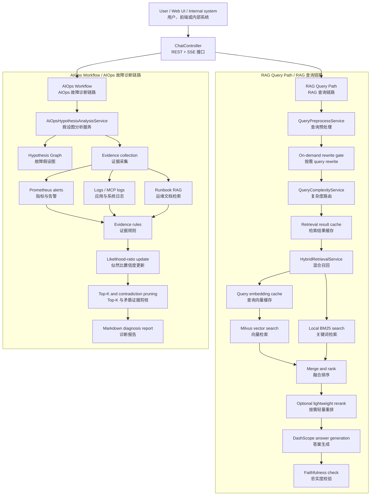
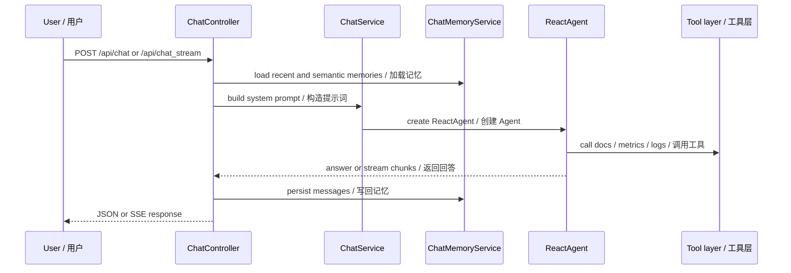
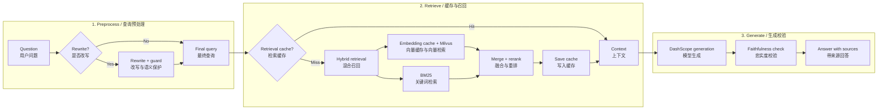
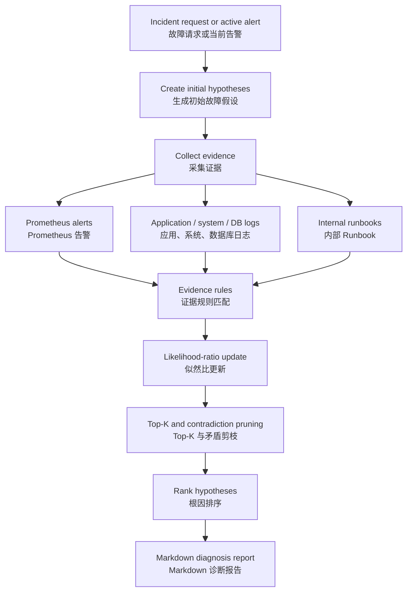

# DevAssist Agent

DevAssist Agent is a Java/Spring Boot service for internal support and on-call workflows. It combines RAG, tool calling, session memory, metrics/log evidence collection, and AIOps diagnosis to help engineers analyze tickets, retrieve internal runbooks, and produce evidence-backed reports.

DevAssist Agent 是一个基于 Java / Spring Boot 的内部支持与 On-call 辅助系统。项目把 RAG 知识库问答、工具调用、会话记忆、指标/日志证据采集和 AIOps 故障诊断串在一起，用来辅助工程师分析工单、检索内部 Runbook，并生成带证据链的诊断报告。

The project is platform-neutral. A ticket can come from an issue tracker, chat bot, alerting system, or any internal support entrypoint, as long as it can be mapped to a text request.

项目不绑定具体入口。请求可以来自工单系统、聊天机器人、告警平台或内部支持页面，只要最终能转换成文本请求，就可以进入同一套分析链路。

## System Overview / 系统总览

总览图重点展示两条主线：

- `RAG Query Path`：围绕知识检索、混合召回、缓存、重排和可信回答。
- `AIOps Workflow`：围绕故障假设图、证据采集、置信度更新和剪枝。



## Main Capabilities / 核心能力

- REST and SSE APIs for chat, ticket analysis, and AIOps diagnosis.
- RAG over internal runbooks and uploaded documents.
- Hybrid retrieval with Milvus vector search and local BM25 search.
- On-demand query rewrite to avoid unnecessary LLM calls for simple queries.
- Query embedding cache and retrieval result cache for lower latency and lower API cost.
- Tool calling for internal docs, Prometheus alerts, logs, and current time.
- Redis-backed short-term session memory and Milvus-backed semantic memory.
- AIOps diagnosis based on a Hypothesis Graph with evidence scoring and pruning.
- Lightweight harness for regression checks against RAG and Agent outputs.

中文说明：

- 通过 REST 和 SSE 接口处理普通问答、工单分析和流式诊断。
- 对内部 Runbook 和上传文档做 RAG 检索，并保留来源信息。
- 同时使用 Milvus 向量检索和本地 BM25 关键词检索，兼顾语义召回和精确关键词命中。
- 对 query rewrite 做按需触发，简单明确的问题直接检索，复杂含糊的问题才改写。
- 对 query embedding 和检索结果做缓存，降低高频问题的响应时间和外部 API 成本。
- AIOps 侧使用故障假设图保存候选根因、证据关系、置信度更新和剪枝结果。

## Runtime Flow / 运行流程

### Chat Flow / 对话流程

普通对话入口会先加载短期记忆和语义记忆，再构造系统提示词。需要外部信息时，Agent 会调用文档、指标、日志等工具，最后把用户和助手消息写回记忆系统。



### RAG Flow / RAG 查询流程

RAG 查询链路的核心优化在前半段：先判断是否需要 query rewrite，再查 retrieval cache；未命中时才进入 embedding cache、向量检索、BM25、重排和可信校验。为了让图在 README 中更紧凑，下面的总览图保留主链路，部分细节在图后说明。



补充说明：

- `Rewrite + guard` 包含按需 query rewrite 和改写前后语义相似度保护。
- `Embedding cache + Milvus` 包含 query embedding cache，未命中时才调用 DashScope embedding。
- `Merge + rerank` 包含向量召回、BM25 召回后的融合排序，以及复杂问题的轻量重排。

### AIOps Flow / AIOps 故障诊断流程

AIOps 链路不会只依赖提示词让模型自由规划，而是在代码层维护故障假设图。每个候选根因都会绑定证据，证据再通过规则映射成置信度更新，最后经过 Top-K 和矛盾证据剪枝输出诊断报告。



The AIOps module stores candidates, evidence, confidence updates, and pruning results in code-level structures under `org.example.service.aiops`.

也就是说，候选根因、证据节点、置信度变化和剪枝过程都有明确的数据结构承载，不是把所有状态都藏在大模型上下文里。

## Project Structure / 项目结构

```text
devassist-agent/
|-- aiops-docs/                         # Example runbooks / 示例运维文档
|-- harness/                            # Regression runner and JSON cases / 回归验证脚本
|-- src/main/java/org/example/
|   |-- agent/tool/                     # Tool-calling adapters / 工具调用适配层
|   |-- client/                         # Milvus client factory / Milvus 客户端
|   |-- config/                         # Spring and infrastructure config / 基础配置
|   |-- controller/                     # REST/SSE controllers / 接口入口
|   |-- dto/                            # Request and response DTOs / 请求响应对象
|   `-- service/
|       |-- aiops/                      # Hypothesis Graph workflow / 故障假设图诊断链路
|       |-- RagService.java             # RAG answer generation / RAG 答案生成
|       |-- TrustedRagRetrievalService.java
|       |-- HybridRetrievalService.java
|       |-- VectorSearchService.java
|       |-- KeywordSearchService.java
|       `-- ChatMemoryService.java
|-- src/main/resources/
|   |-- static/                         # Web UI / 前端静态页面
|   `-- application.yml                 # Application configuration / 应用配置
|-- vector-database.yml                 # Milvus / Redis compose file
|-- Makefile
`-- pom.xml
```

## Requirements / 环境要求

- Java 17
- Maven 3.8+
- Docker / Docker Compose
- DashScope API key

## Quick Start / 快速启动

### 1. Configure Environment / 配置环境变量

先配置 DashScope API Key，项目中的对话生成、query rewrite 和 embedding 都会用到它。

```bash
export DASHSCOPE_API_KEY=your-dashscope-api-key
```

如果需要接入外部 MCP 工具，可以再打开 MCP 客户端配置；默认关闭，方便本地单独启动。

```bash
export MCP_CLIENT_ENABLED=true
export TENCENT_MCP_URL=https://mcp-api.tencent-cloud.com
export TENCENT_MCP_SSE_ENDPOINT=/sse/your-endpoint
```

### 2. Start Milvus and Redis / 启动 Milvus 和 Redis

Milvus 用来保存文档向量，Redis 用来保存短期会话记忆和部分运行状态。

```bash
docker compose -f vector-database.yml up -d
```

Default endpoints / 默认地址：

```text
Milvus: localhost:19530
Redis:  localhost:6379
```

### 3. Start the Service / 启动服务

启动 Spring Boot 服务后，可以通过 `http://localhost:9900` 访问后端接口和静态页面。

```bash
mvn clean install
mvn spring-boot:run
```

```text
http://localhost:9900
```

## API / 接口

### Chat / 普通问答

普通问答接口，适合一次性返回完整回答。

```http
POST /api/chat
Content-Type: application/json

{
  "Id": "session-001",
  "Question": "How should I investigate a 500 error in order-service?"
}
```

### Streaming Chat / 流式问答

流式问答接口，适合前端边生成边展示。

```http
POST /api/chat_stream
Content-Type: application/json

{
  "Id": "session-001",
  "Question": "Analyze this incident and return a step-by-step plan."
}
```

### AIOps Diagnosis / AIOps 诊断

AIOps 故障诊断接口，返回 SSE 流式 Markdown 报告。请求体为空时，会基于当前可用的告警、日志和 Runbook 证据做主动分析。

```http
POST /api/ai_ops
Content-Type: application/json

{
  "userRequest": "payment-service is unavailable, CPU is high, and several database timeout logs were observed."
}
```

### Upload Documents / 上传文档

上传文档后，系统会自动切片、生成 embedding、写入 Milvus，并同步构建本地 BM25 索引。

```bash
curl -X POST http://localhost:9900/api/upload \
  -F "file=@aiops-docs/cpu_high_usage.md"
```

## Configuration / 配置

Main configuration file / 主要配置文件：

```text
src/main/resources/application.yml
```

Important sections / 关键配置段：

```yaml
server:
  port: 9900

spring:
  data:
    redis:
      host: ${REDIS_HOST:localhost}
      port: ${REDIS_PORT:6379}
  ai:
    dashscope:
      api-key: ${DASHSCOPE_API_KEY:your-api-key-here}
    mcp:
      client:
        enabled: ${MCP_CLIENT_ENABLED:false}

milvus:
  host: localhost
  port: 19530

dashscope:
  embedding:
    model: text-embedding-v4
    query-cache:
      enabled: true
      max-size: 10000
      ttl-seconds: 1800

rag:
  top-k: 3
  model: "qwen3-max"
  query-rewrite:
    enabled: true
    on-demand-enabled: true
    min-trigger-length: 24
    min-similarity: 0.8
  retrieval:
    simple-mode: HYBRID
    complex-mode: HYBRID
    candidate-multiplier: 3
    vector-weight: 0.65
    bm25-weight: 0.35
    cache:
      enabled: true
      max-size: 2000
      ttl-seconds: 300
  rerank:
    enabled: true
  faithfulness:
    enabled: true

chat:
  memory:
    redis-enabled: true
    semantic-enabled: true
```

## AIOps Hypothesis Graph / AIOps 故障假设图

AIOps 故障假设图相关实现位于：

```text
src/main/java/org/example/service/aiops
```

Core concepts / 核心概念：

- `HypothesisNode`: candidate root cause with prior and posterior confidence. 候选故障根因，保存先验置信度和后验置信度。
- `EvidenceNode`: alert, metric, log, runbook, or tool-error evidence. 证据节点，可以来自告警、指标、日志、Runbook 或工具错误。
- `EvidenceStrength`: evidence level mapped to a likelihood ratio. 证据力度等级，会映射为似然比。
- `HypothesisGraph`: graph storage for hypotheses, evidence, and relationships. 保存故障假设、证据和关系的图结构。
- `AiOpsEvidenceRuleService`: maps evidence to hypotheses. 把证据映射到对应故障假设。
- `AiOpsReportService`: renders the final Markdown report. 把最终诊断过程渲染为 Markdown 报告。

Evidence strength is represented by likelihood ratios / 证据力度使用似然比表示：

```text
STRONG_SUPPORT          LR = 10.0
MEDIUM_SUPPORT          LR = 3.0
WEAK_SUPPORT            LR = 1.5
NEUTRAL                 LR = 1.0
WEAK_CONTRADICTION      LR = 0.7
MEDIUM_CONTRADICTION    LR = 0.3
STRONG_CONTRADICTION    LR = 0.1
```

This keeps confidence changes auditable: every posterior update can be traced back to a specific evidence item and rule.

这样做的好处是可解释：每一次置信度上升或下降，都能追溯到具体证据和具体规则，而不是只给出一个不可解释的模型结论。

## RAG Reliability and Performance / RAG 可靠性与性能

The current RAG pipeline includes / 当前 RAG 链路包括：

- Query rewrite with semantic similarity guard. query rewrite 带语义相似度保护，避免改写后语义漂移。
- On-demand query rewrite. 简单明确的问题直接检索，复杂含糊的问题才触发改写。
- Query embedding cache. 缓存高频 query 的向量，降低 embedding 成本。
- Retrieval result cache. 缓存重复检索结果，提升热点问题响应速度。
- Complexity-based retrieval routing. 基于问题复杂度选择检索和重排策略。
- Hybrid vector + BM25 retrieval. 向量检索和 BM25 混合召回。
- Lightweight reranking. 对复杂问题或候选结果竞争明显的情况做轻量重排。
- Source indexing. 保留来源索引，方便回答追溯。
- Faithfulness verification after generation. 生成后做忠实度校验，降低脱离证据的风险。

Recommended production optimizations / 后续生产化方向：

- Cache query embeddings and retrieval results. 继续提升 query embedding 和检索结果缓存命中率。
- Trigger query rewrite only for complex or ambiguous requests. 只对复杂或含糊问题触发 query rewrite。
- Run vector search and BM25 search in parallel. 向量检索和 BM25 并行执行。
- Precompute BM25 document frequency with an inverted index. 用倒排索引预计算 BM25 词频。
- Add request coalescing for identical hot queries. 对热点相同请求做请求合并。
- Route simple queries to smaller models and reserve larger models for complex reasoning. 简单问题走更小模型，复杂推理再使用大模型。
- Limit context tokens by extracting only the most relevant snippets. 控制上下文 token，只保留最相关片段。
- Add rate limits and graceful degradation around embedding, Milvus, and LLM calls. 对 embedding、Milvus、LLM 增加限流和降级。

## Harness / 回归验证

服务启动后，可以运行轻量回归脚本检查 RAG 和 Agent 输出是否出现明显退化。

```bash
python harness/runner.py
```

Specify a different base URL / 指定服务地址：

```bash
python harness/runner.py --base-url http://localhost:9900
```

Reports are written to / 报告输出位置：

```text
harness/reports/latest-report.json
```

## Development Notes / 开发提示

- `prometheus.mock-enabled=true` enables mock Prometheus alert data. 启用模拟 Prometheus 告警数据，方便本地验证 AIOps。
- `cls.mock-enabled=true` enables mock log data. 启用模拟日志数据。
- `rag.bm25.bootstrap-enabled=true` loads local uploaded documents into the BM25 index at startup. 启动时把本地上传文档加载到 BM25 索引。
- `MCP_CLIENT_ENABLED=false` keeps external MCP clients disabled by default. 默认不连接外部 MCP 服务，降低本地启动依赖。

## License / 许可证

See [LICENSE](LICENSE).
